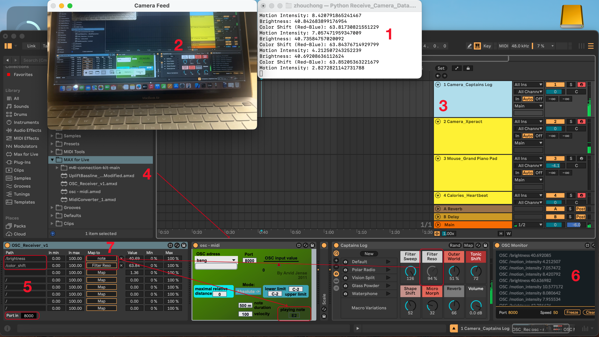
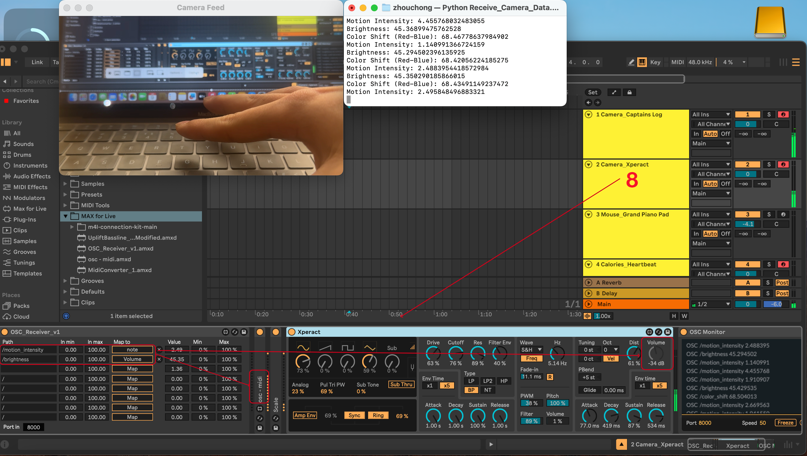
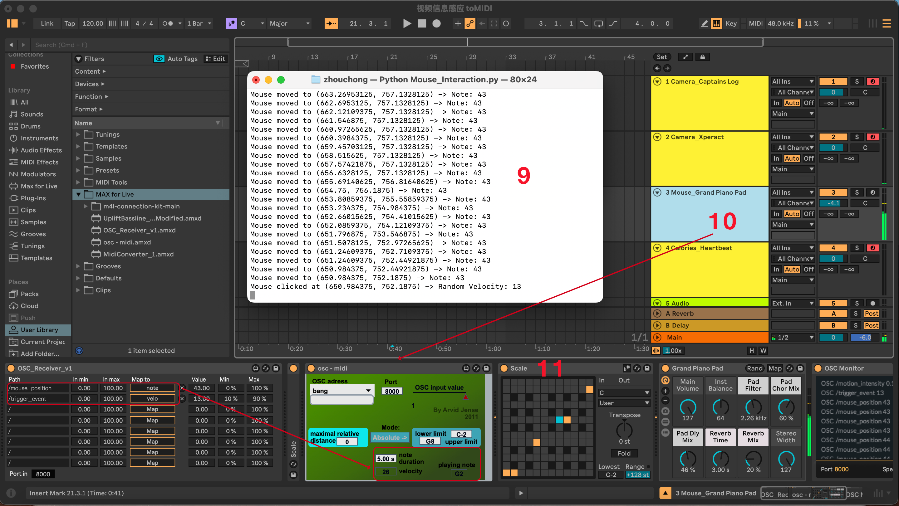

# OSC Interactive Music: Real-Time Data MIDI Mapping

[中文版](./README.md)

## 1 Introduction

This Demo uses macOS as an example to demonstrate how to transfer camera data, mouse interactions, and health data (e.g., heart rate and calories) to a DAW via the OSC protocol to generate MIDI music in real time (using Ableton Live as an example). The project code is a simplified personal idea, and apart from data acquisition, creators can focus on how to map synthesizer parameters and arrange musical notes, thereby exploring new ideas for music composition and sound design.

---


## 2 Core Features

- **Real-Time Data Collection**:

  - Camera frame brightness, color offset, and motion intensity
  - Mouse movement and clicks
  - Health data: heart rate and calories

- **OSC Data Transmission**:

  - Transmit processed data to Ableton Live or other OSC-compatible software.

- **Music Generation**:

  - Map data to MIDI notes, velocity, and filter parameters.

---


## 3 Technology Stack and Dependency Installation

- **Python**: Use libraries like OpenCV or Pynput to flexibly receive or collect data, process the logic, map the data to music parameter ranges, and convert it into OSC-formatted signals. These signals are transmitted to the DAW through specified paths and ports for music generation.

  - **Setup**: Run the following commands to install the required Python dependencies.

```
  python3 -m pip install opencv-python python-osc pynput
```
  

- **HealthKit + Xcode (Optional)**: Build a bridging application with Xcode to collect motion data from Apple Watch using the HealthKit component and send the data to a Python receiver for additional data-driven functionality.

  - **Install Xcode**: Download and install Xcode from the App Store on macOS.

  - **Enable HealthKit**: Open the project and enable HealthKit under the **Capabilities** section.

  - **Run the App**: Connect your iPhone (ensure Developer Mode is enabled), select the device, and click the **Run** button to deploy the app.

- **Ableton Live (Optional)**: Receive OSC signals and use Max for Live plugins to map the data to MIDI synthesizer parameters, resulting in the final musical effects.

  - **Install Ableton Live**: Download and install Ableton Live from the [Ableton website](https://www.ableton.com/) (the Suite version is recommended as it includes Max for Live functionality).

  - **Enable Max for Live**: Ensure **Max for Live** is activated in **Preferences > Licenses/Maintenance**.

  - **Load Max for Live Plugins**: Below are some example plugins to help you quickly set up OSC data reception and conversion.

    - **[OSC Receiver](https://maxforlive.com/library/device/7752/osc-receiver-osc-in)**: A simple OSC receiver plugin that listens to OSC messages on specified ports.
    - **[Simple OSC to MIDI](https://maxforlive.com/library/device/987/simple-osc-to-midi)**: Maps incoming OSC data to MIDI notes or parameters for real-time music generation.
    - **[Connection Kit](https://github.com/Ableton/m4l-connection-kit)**: An official toolkit from Ableton that includes various OSC and MIDI tools, enabling connections to sensors, controllers, and other devices for more interactive applications.


---


## 4 Demo 1: Camera and Mouse Data

### **4.1 Python Data Capture and OSC Transmission:**

- **Components Involved:**
  pythonosc.udp\_client: Send OSC messages to transmit processed data to Ableton.

- Use PythonOSC to establish UDP communication and transmit data to Ableton Live in real time.

- **Network Configuration:**

  - Local IP Address: 127.0.0.1 (local device communication).
  - UDP Port: 8000 (Ensure that the listening port of the Ableton track plugin matches).

### **4.2 Camera Data Mapping:**

- Using OpenCV to capture screen brightness, color shift (warmth vs. coolness), and motion intensity (degree of camera movement) for generating dynamic music. **The mapping relationships can be customized based on the target parameters of the synthesizer.**

- **Data Mapping and Ranges:**

  - **Frame Brightness**: Mapped from `[0, 255]` to `[0, 127]`. Suitable for controlling melody dynamics, in this case used for generating MIDI and mapping to pitch. Higher brightness corresponds to higher pitch, path `/brightness`.  

  - **Color Offset**: Mapped from `[-255, 255]` to `[0, 127]`. Suitable for controlling timbre variation, in this case used for filter adjustments. Warmer colors can correspond to softer timbres, cooler colors to harder timbres, path `/color_shift`.  

  - **Motion Intensity**: Mapped from `[0, 255]` to `[0, 127]`. In this case, it is used for a supplementary track’s accent timbre. Higher intensity corresponds to stronger dynamic effects, while lower intensity corresponds to weaker ones, path `/motion_intensity`.

- **Components Involved:**
  `cv2`: Used for capturing video frames and image processing, such as calculating brightness and detecting motion intensity.
  `numpy`: Used for efficient mathematical calculations, such as calculating average brightness and frame differences.
  `time`: Controls the time logic of the script, such as frame rate and delays.

- **Sample Code**: [Receive_Camera_Data.py](./osc_midi_scripts/Receive_Camera_Data.py) 

```python
import cv2
from pythonosc.udp_client import SimpleUDPClient
import numpy as np
import time

# Configure OSC client
LOCAL_IP = "127.0.0.1"  # Local loopback address
LOCAL_PORT = 8000       # OSC receiving port
client = SimpleUDPClient(LOCAL_IP, LOCAL_PORT)

# Initialize the camera
cap = cv2.VideoCapture(0)

# Define OSC addresses
OSC_ADDRESS_BRIGHTNESS = "/brightness"
OSC_ADDRESS_COLOR_SHIFT = "/color_shift"
OSC_ADDRESS_MOTION_INTENSITY = "/motion_intensity"

# Initialize the previous frame (for motion detection)
prev_frame = None

def normalize(value, old_min, old_max, new_min=0, new_max=127):
    """Normalize the value to the range 0-127"""
    return new_min + (value - old_min) * (new_max - new_min) / (old_max - old_min)

try:
    while cap.isOpened():
        ret, frame = cap.read()
        if not ret:
            break

        # Convert to grayscale
        gray = cv2.cvtColor(frame, cv2.COLOR_BGR2GRAY)

        # 1. **Brightness mapping**: Calculate average brightness
        avg_brightness = np.mean(gray)
        normalized_brightness = normalize(avg_brightness, 0, 255)  # Grayscale range is [0, 255]
        client.send_message(OSC_ADDRESS_BRIGHTNESS, normalized_brightness)
        print(f"Brightness: {normalized_brightness}")

        # 2. **Color shift mapping**: Calculate RGB distribution shift
        avg_color = frame.mean(axis=(0, 1))  # Get the average values of the RGB channels
        color_shift = avg_color[2] - avg_color[0]  # Difference between red and blue channels
        normalized_color_shift = normalize(color_shift, -255, 255)  # Assume color difference range is [-255, 255]
        client.send_message(OSC_ADDRESS_COLOR_SHIFT, normalized_color_shift)
        print(f"Color Shift (Red-Blue): {normalized_color_shift}")

        # 3. **Motion intensity mapping**: Detect motion intensity through frame differences
        if prev_frame is not None:
            frame_diff = cv2.absdiff(prev_frame, gray)  # Calculate the difference between the current and previous frames
            motion_intensity = np.sum(frame_diff) / (frame_diff.shape[0] * frame_diff.shape[1])  # Average difference
            normalized_motion_intensity = normalize(motion_intensity, 0, 255)  # Difference range is [0, 255]
            client.send_message(OSC_ADDRESS_MOTION_INTENSITY, normalized_motion_intensity)
            print(f"Motion Intensity: {normalized_motion_intensity}")

        prev_frame = gray  # Update the previous frame

        # Display the video feed
        cv2.imshow('Camera Feed', frame)

        # Press 'q' to exit
        if cv2.waitKey(1) & 0xFF == ord('q'):
            break

except KeyboardInterrupt:
    print("Stopped sending OSC messages.")

finally:
    cap.release()
    cv2.destroyAllWindows()
```

### **4.3 Mouse Data Mapping:**

- Capture mouse position and clicks to dynamically generate melodies and control volume.

- **Components Involved:**
  `pynput.mouse`: Listens to mouse movements and click events, mapping mouse position and actions to musical parameters such as pitch and velocity.
  `random`: Randomly generates data, e.g., MIDI velocity during mouse clicks, to enhance musical expressiveness and diversity.

- **Data Mapping and Ranges:**

  - **Mouse Movement**: Mapping range is [0, 127], corresponding to MIDI Note pitch values. This range is chosen to align with the standard MIDI note range, where lower coordinate values map to lower pitches and higher values map to higher pitches. Path: `/mouse_position`.

  - **Mouse Clicks**: Mapping range is [0, 127], corresponding to MIDI Velocity (volume intensity). This range is chosen to control the dynamic performance of notes, generating rich melodies in combination with the X-coordinate. Path: `/trigger_event`.

- **Sample Code**: [Mouse_Interaction.py](./osc_midi_scripts/Mouse_Interaction.py)

```python
from pynput import mouse
from pythonosc.udp_client import SimpleUDPClient
import random

# Configure OSC Client
LOCAL_IP = "127.0.0.1"  # Local loopback address
LOCAL_PORT = 8000       # OSC receiving port
client = SimpleUDPClient(LOCAL_IP, LOCAL_PORT)

# Screen Dimensions (Adjust to your screen resolution)
SCREEN_WIDTH = 1920
SCREEN_HEIGHT = 1080

# Callback Function: Mouse Movement
def on_move(x, y):
    # Map Mouse X Coordinate to MIDI Note Number (0–127)
    note = int((x / SCREEN_WIDTH) * 127)
    # Send OSC Message to /mouse_position
    client.send_message("/mouse_position", note)
    print(f"Mouse moved to ({x}, {y}) -> Note: {note}")

# Callback Function: Mouse Click
def on_click(x, y, button, pressed):
    if pressed:
        # Generate Random MIDI Velocity (0–127) on Mouse Click
        velocity = random.randint(0, 127)
        # Send OSC Message to /trigger_event
        client.send_message("/trigger_event", velocity)
        print(f"Mouse clicked at ({x}, {y}) -> Random Velocity: {velocity}")

# Monitor Mouse Activity
with mouse.Listener(on_move=on_move, on_click=on_click) as listener:
    listener.join()
```

### **4.4 Ableton Live Practical Example:**



**1. Start Camera Data Capture**  

Run the Python script in the terminal:  

```bash
python3 Receive_Camera_Data.py
```

**2. Camera Configuration**  

Call the default camera (index 0). In this case, it is the iPhone camera:  

```python
import cv2
cap = cv2.VideoCapture(1)  # 0 is the default camera index
```
**Tip: You can adjust the default camera in Mac's FaceTime settings and then close FaceTime to easily update the system's default camera.** 

**3. Create the Main Audio Track for Camera Interaction**    

For this case, an ambient Drone sound was chosen as the main sound, which is suitable for random generation and has high fault tolerance. The sound comes from the Ableton official pack **Drone Lab**.

**4. Add Required Max for Live Plugins and MIDI Instruments**  

Drag Max for Live plugins like `OSC Receiver` and `OSC to MIDI` into the track. (Refer to “3 Technical Stack and Dependency Installation” for sources)

**5. Configure Parameters in the OSC Receiver Plugin**   

- Enter the target Python IP port in **Port in** (8000 in this case).  

- Enter the OSC data address output from Python in **Path**.  

**6. Troubleshooting Tip:** If no data is received, use `OSC Monitor` to check whether data is successfully received and if the format and address match.

**7. Use the Map Function to Assign Parameters**    

- Ensure there is a function to **automatically play MIDI notes** from received OSC data. In this case, the `OSC to MIDI` plugin's **Playing Note** feature is used, **and this method is consistently applied for subsequent track configurations**.

- In this case, brightness `/brightness` is used to trigger MIDI playback, and color offset `/color_shift` modifies one of the MIDI instrument's sound parameters to create dynamic tonal changes.



**8. Create a Secondary Audio Track for Camera Interaction**  

Repeat steps 3 to 7 for configuration or directly duplicate the main audio track and adjust as needed:  

- For this case, a noise-type sound is chosen as a complementary layer, using the default MIDI instrument **Xperact**.  

- Motion intensity `/motion_intensity` is used to trigger MIDI, while brightness `/brightness` controls its volume.  



**9. Start Mouse Data Capture**  
Run the Python script in the terminal:   

```bash
python3 Receive_Mouse_Data.py
```

**10. Create an Audio Track for Mouse Interaction**  

Repeat steps 3 to 7 for configuration or directly duplicate the main audio track and adjust as needed:  

- For stronger feedback from mouse interactions, a MIDI instrument with a clear scale is recommended. In this case, the piano sound **Grand Piano Pad** was selected.  

- Mouse position `/mouse_position` triggers MIDI notes, while click events `/trigger_event` randomly control velocity.


**11. Optimization Tip:**  

- The OSC data `value` received by `OSC Receiver` can be flexibly adjusted using `Max` and `Min` to define the mapping range.

- Note that the `note duration` parameter in the `OSC to MIDI` plugin should not be set too short for certain MIDI instruments; otherwise, no sound may be produced.

- Add plugins according to composition or mixing needs, such as:  Use `MIDI Scale` to ensure MIDI notes are restricted to a specific scale. Use a `Limiter` to avoid clipping caused by excessive signal levels.


---


## 5 Demo 2: Health Data


### 5.1 Health Data Bridging:

- **Xcode App Development:**

  - Download and install Xcode, create a new iOS project, and select SwiftUI as the UI building tool.

  - Enable the HealthKit framework in project settings and ensure the necessary permissions are added. Create a `HealthKitManager.swift` file to retrieve calorie data.

  - Authorize users to read health data, ensuring privacy compliance.

  - Build the front-end interface in the original `ContentView.swift` to display real-time activity data and trigger authorization logic.

  - Connect the iPhone to Mac via a data cable, trust the computer on the iPhone as prompted, and enable Developer Mode under "Settings > Privacy & Security > Developer Mode."
    Open Xcode, click "Device and Simulators" in the top menu, ensure the iPhone is correctly connected and displayed in the device list, and complete the configuration as prompted.
    Select iPhone in the Xcode target device menu and click "Run" to deploy the app to the iPhone for testing.

  - After running, UDP protocol can send calorie data to the planned Python module for subsequent processing.

- **Correctly Configure HealthKit Permissions in Info.plist**

  - **Locate the Info.plist File**:
    - Open Xcode and select your project name in the left **Project Navigator**.
    - Select **TARGETS** > your app target (e.g., `HealthKitApp`).
    - Click the **Info** tab at the top.

  - **Add Necessary Permission Descriptions**:
    Under **Custom iOS Target Properties**, manually add the following two items:
    - `NSHealthShareUsageDescription`  **Value**: This app requires access to your health data to display health data information.
    - `NSHealthUpdateUsageDescription`  **Value**: This app requires permission to update your health data.

- **Core Functionality Files:**

  - **`HealthKitManager.swift`**: Responsible for retrieving calorie or heart rate data via the HealthKit framework and sending it to the Python receiver via UDP. The UDP IP address is set to the Mac's IP address (e.g., `192.168.1.142`), ensuring that the iPhone and Mac are on the same network. 

    - **Tips:**
    Ensure that the IP address (oscHost) set in `HealthKitManager` matches your Mac’s actual local network IP address rather than the local loopback `127.0.0.1`, as this would point to the iPhone itself.

    - **Sample Code**: [HealthKitManager_CaloriesBurned.swift](./health_data_bridge/HealthKitManager_CaloriesBurned.swift)

```swift
import Foundation
import HealthKit
import Network

class HealthKitManager: ObservableObject {
    let healthStore = HKHealthStore()
    
    // We only track the cumulative value for the current session
    @Published var sessionCalories: Double = 0.0
    
    private var sessionStartTime: Date?
    private var lastSentCalories: Double? // The last sent calorie value, nil means no data has been sent yet
    
    // UDP-related
    private var connection: NWConnection?
    private let oscHost = "192.168.1.142" // Modify the IP address as per your requirement
    private let oscPort: UInt16 = 9000
    
    // Timer
    private var timer: Timer?

    init() {
        setupConnection()
    }

    func setupConnection() {
        connection = NWConnection(
            host: NWEndpoint.Host(oscHost),
            port: NWEndpoint.Port(rawValue: oscPort)!,
            using: .udp
        )
        connection?.stateUpdateHandler = { state in
            switch state {
            case .ready:
                print("Connection ready on \(self.oscHost):\(self.oscPort)")
            case .failed(let error):
                print("Connection failed: \(error.localizedDescription)")
            default:
                break
            }
        }
        connection?.start(queue: .main)
    }

    // --------------------------------------
    // MARK: - Request Authorization
    // --------------------------------------
    func requestAuthorization() {
        guard HKHealthStore.isHealthDataAvailable() else {
            print("HealthKit not available on this device")
            return
        }
        
        let activeEnergyBurnedType = HKObjectType.quantityType(forIdentifier: .activeEnergyBurned)!
        let typesToRead: Set<HKObjectType> = [activeEnergyBurnedType]
        
        healthStore.requestAuthorization(toShare: nil, read: typesToRead) { success, error in
            if success {
                print("HealthKit authorization granted")
            } else {
                print("Authorization failed: \(error?.localizedDescription ?? "Unknown error")")
            }
        }
    }
    
    // --------------------------------------
    // MARK: - Start Session: Record Start Point & Start Monitoring
    // --------------------------------------
    func startSession() {
        sessionStartTime = Date()  // Start tracking from now
        sessionCalories = 0.0      // Reset
        lastSentCalories = nil     // Reset the last sent value
        
        // Start Observer Query
        startObserverQuery()
        
        // Start a timer to fetch data every 5 seconds as a fallback
        timer = Timer.scheduledTimer(withTimeInterval: 5.0, repeats: true) { [weak self] _ in
            guard let self = self, let startTime = self.sessionStartTime else { return }
            
            self.fetchAccumulatedCalories(since: startTime) { value in
                print("Periodic fetch: \(value) kcal")
            }
        }
    }
    
    func stopSession() {
        timer?.invalidate()
        timer = nil
        sessionStartTime = nil
    }

    // --------------------------------------
    // MARK: - Observer Query: Listen for underlying data write events
    // --------------------------------------
    private func startObserverQuery() {
        let activeEnergyBurnedType = HKObjectType.quantityType(forIdentifier: .activeEnergyBurned)!
        let query = HKObserverQuery(sampleType: activeEnergyBurnedType, predicate: nil) { [weak self] _, completionHandler, error in
            if let error = error {
                print("Observer query error: \(error.localizedDescription)")
                return
            }

            guard let self = self, let startTime = self.sessionStartTime else { return }
            
            // Trigger data update
            self.fetchAccumulatedCalories(since: startTime) { value in
                print("Observer fetch: \(value) kcal")
            }
            
            completionHandler() // Notify the system that the observer has completed processing
        }
        
        healthStore.execute(query)
    }

    // --------------------------------------
    // MARK: - Query: From a custom start point to now
    // --------------------------------------
    func fetchAccumulatedCalories(since startTime: Date, completion: @escaping (Double) -> Void) {
        let now = Date()
        
        let predicate = HKQuery.predicateForSamples(
            withStart: startTime,
            end: now,
            options: .strictStartDate
        )
        
        let activeEnergyBurnedType = HKQuantityType.quantityType(forIdentifier: .activeEnergyBurned)!
        let query = HKStatisticsQuery(
            quantityType: activeEnergyBurnedType,
            quantitySamplePredicate: predicate,
            options: .cumulativeSum
        ) { _, result, error in
            
            // If result or sumQuantity() is nil, set calories to 0
            let kcalValue: Double
            if let result = result, let sum = result.sumQuantity() {
                kcalValue = sum.doubleValue(for: .kilocalorie())
            } else {
                kcalValue = 0
            }
            
            DispatchQueue.main.async {
                self.sessionCalories = kcalValue

                // ----------------------------------------
                // Force sending data when calories are 0,
                // For non-zero values, send only if it changes or it's the first time
                // ----------------------------------------
                if kcalValue == 0 {
                    print("===> [Always send 0] lastSentCalories: \(String(describing: self.lastSentCalories)), current: \(kcalValue)")
                    self.sendCaloriesToOSC(kcalValue)
                    self.lastSentCalories = kcalValue
                } else if self.lastSentCalories == nil || kcalValue != self.lastSentCalories {
                    print("===> [Send changed value] lastSentCalories: \(String(describing: self.lastSentCalories)), current: \(kcalValue)")
                    self.sendCaloriesToOSC(kcalValue)
                    self.lastSentCalories = kcalValue
                } else {
                    print("===> [No send] lastSentCalories: \(String(describing: self.lastSentCalories)), current: \(kcalValue)")
                }
                
                completion(kcalValue)
            }
        }
        
        healthStore.execute(query)
    }
    
    // --------------------------------------
    // MARK: - Send Data to Python (OSC)
    // --------------------------------------
    func sendCaloriesToOSC(_ calories: Double) {
        guard let connection = connection else {
            print("Connection not established")
            return
        }

        let oscMessage = "/counter,\(calories)"
        guard let messageData = oscMessage.data(using: .utf8) else {
            print("Failed to encode OSC message")
            return
        }

        connection.send(content: messageData, completion: .contentProcessed { error in
            if let error = error {
                print("Failed to send OSC message: \(error.localizedDescription)")
            } else {
                print("Sent session-based kcal to OSC: \(oscMessage)")
            }
        })
    }
    // --------------------------------------
    // MARK: - Add kcal Manually（For testing）
    // --------------------------------------
    func addManualCalories(_ calories: Double) {
        DispatchQueue.main.async {
            self.sessionCalories += calories
            self.sendCaloriesToOSC(self.sessionCalories)
            print("Manually added \(calories) kcal. New sessionCalories: \(self.sessionCalories)")
        }
    }
}
```

  - **`ContentView.swift`**: Provides a real-time UI to display calorie data and trigger HealthKit authorization.
    - **Sample Code**: [ContentView_CaloriesBurned.swift](./health_data_bridge/ContentView_CaloriesBurned.swift)

```swift
import SwiftUI

struct ContentView: View {
    @StateObject private var healthKitManager = HealthKitManager()
    @State private var isSessionActive = false // Flag to indicate whether the session is active

    var body: some View {
        VStack(spacing: 20) {
            Text("Workout Session")
                .font(.largeTitle)
                .padding()

            // Display the total calories burned during the current session
            Text("Session Calories Burned: \(healthKitManager.sessionCalories, specifier: "%.2f") kcal")
                .padding()
                .font(.title2)

            HStack(spacing: 20) {
                // Start session button
                Button(action: {
                    if !isSessionActive {
                        healthKitManager.requestAuthorization()
                        healthKitManager.startSession()
                        isSessionActive = true
                    }
                }) {
                    Text("Start Session")
                        .padding()
                        .frame(maxWidth: .infinity)
                        .background(isSessionActive ? Color.gray : Color.green)
                        .foregroundColor(.white)
                        .cornerRadius(10)
                }
                .disabled(isSessionActive) // Prevent starting the session multiple times

                // Stop session button
                Button(action: {
                    if isSessionActive {
                        healthKitManager.stopSession()
                        isSessionActive = false
                    }
                }) {
                    Text("Stop Session")
                        .padding()
                        .frame(maxWidth: .infinity)
                        .background(isSessionActive ? Color.red : Color.gray)
                        .foregroundColor(.white)
                        .cornerRadius(10)
                }
                .disabled(!isSessionActive) // Only enabled when the session is active
            }
            .padding()

            // Button to manually add 1 kcal
            Button(action: {
                healthKitManager.addManualCalories(1.0)
            }) {
                Text("Manually Add 1 kcal")
                    .padding()
                    .frame(maxWidth: .infinity)
                    .background(Color.blue)
                    .foregroundColor(.white)
                    .cornerRadius(10)
            }
            .padding()

            Spacer()
        }
        .padding()
        .onChange(of: healthKitManager.sessionCalories) { newValue in
            print("Session Calories updated: \(newValue)")
        }
    }
}
```
  - In addition, the Swift files for synchronizing heart rate are also provided here for creators to do on their own. [HealthKitManager_HeartRate.swift](./health_data_bridge/HealthKitManager_HeartRate.swift) and [ContentView_HeartRate.swift](./health_data_bridge/ContentView_HeartRate.swift)


### **5.2 Python Data Reception, OSC Transmission, and Mapping**

- **Data Reception**

  - **Method:** Python uses the `socket` module to set up a UDP server, listening on port 9000, to receive calorie data from the Swift client.

  - **Message Format:** The Swift client sends messages in OSC protocol format as `/counter,\<calories>`, which Python parses to extract calorie values.

  - **Components Involved:** 
    `socket` is used to receive health data, establishing a server to listen for data streams over the UDP protocol.

- **Data Transmission**

  - Using PythonOSC, the received data is forwarded to a specified target port (default example: Ableton Live's port 9000 with OSC path `/counter`), laying the groundwork for MIDI mapping.

  - **Target Address:** The default is the local loopback address (127.0.0.1), but it can be freely defined for any target address to achieve cross-device or network transmission.

  - **Components Involved:**
    `threading` is used to create a separate thread for sending MIDI note data in parallel, ensuring the main program remains unblocked.
    `pythonosc.udp\_client` sends OSC messages, transmitting the mapped health data to the target device or software (e.g., Ableton Live).

- **Data Mapping:**
  - **Components Involved:**
    `time` controls the data sending frequency, dynamically adjusting the interval using an exponential smoothing algorithm to ensure a smoother frequency transition reflecting calorie changes.
    `random` generates random MIDI notes by selecting from the dominant seventh chord while avoiding repeated notes.
     **Higher calorie consumption corresponds to higher notes, and the playback frequency becomes more intense to reflect dynamic activity levels.**

  - **Calorie to MIDI Note Mapping:**
    - Calorie Range: [0, 100] kcal.
    - MIDI Note Range: [21 (A0), 108 (C8)].
    - Mapping Formula: `midi_note = int(21 + (calories / 100) * (108 - 21))`.

  - **Time Interval Mapping:**
    - Initial Time Interval: 5 seconds.
    - Exponential Smoothing Formula: `smooth_interval = (1 - ALPHA) * smooth_interval + ALPHA * (5.0 / (calories + 1))`.
    - Limitation: `interval = max(0.1, smooth_interval)`.
   
    
```python
import socket
import threading
from pythonosc.udp_client import SimpleUDPClient
import time
import random  # Used to randomly select a MIDI note

# -----------------------
# Global Variables
# -----------------------
running = True                # Controls the thread's running state
current_calories = 0.0        # Current calorie value
root_note = 21                # Initial note (Lowest note A0 on Grand Piano)
last_note = None              # Tracks the last sent note to avoid repetition

# Note interval related: initial interval 5s, using exponential smoothing
smooth_interval = 5.0         # Temporary variable for smoothing
current_interval = 5.0        # Actual interval for controlling note sending
ALPHA = 0.1                   # Smoothing factor (0~1, smaller means smoother)

# Dominant seventh chord offsets (Root, Major third, Perfect fifth, Minor seventh)
dominant_seventh_offsets = [0, 4, 7, 10]

# -----------------------
# Socket Configuration
# -----------------------
# Set up a socket to receive calorie data
receive_sock = socket.socket(socket.AF_INET, socket.SOCK_DGRAM)
receive_sock.bind(("0.0.0.0", 9000))  # Listen on port 9000

# Set up an OSC client for Ableton
ABLETON_IP = "127.0.0.1"  # Local loopback address
ABLETON_PORT = 8000       # Port used by Ableton to receive OSC messages
client = SimpleUDPClient(ABLETON_IP, ABLETON_PORT)

def map_calories_to_midi(calories):
    """
    Map calorie values to MIDI notes in the Grand Piano range.
    - Calorie range: 0~100
    - MIDI range: 21~108 (A0 ~ C8)
    """
    midi_note = int(21 + (calories / 100) * (108 - 21))
    return min(max(midi_note, 21), 108)  # Limit range to [21, 108]

def send_midi():
    """
    Send MIDI data periodically in a separate thread.
    Adjust sending speed based on current_interval (sleep time).
    """
    global running, current_calories, root_note, last_note
    while running:
        # Here, current_calories == 0 is no longer checked
        # Add logic if you want to mute when calories are 0
        chord_notes = [root_note + offset for offset in dominant_seventh_offsets]

        # Randomly select a note to send
        available_notes = [note for note in chord_notes if note != last_note]
        if not available_notes:
            available_notes = chord_notes
        note_to_send = random.choice(available_notes)
        last_note = note_to_send

        # Send to Ableton
        client.send_message("/counter", note_to_send)
        print(f"Sent MIDI Note: {note_to_send} (cal: {current_calories}, interval: {current_interval:.2f}s)")

        time.sleep(current_interval)

# Start thread to send MIDI data
midi_thread = threading.Thread(target=send_midi)
midi_thread.start()

print("Listening for calorie data on port 8000...")

try:
    while True:
        # Receive calorie data
        data, addr = receive_sock.recvfrom(1024)
        message = data.decode('utf-8')
        print(f"Received message: {message} from {addr}")

        # Parse calorie data and update current value
        if message.startswith("/counter,"):
            try:
                calories = float(message.split(",")[1])
                current_calories = calories
                print(f"Current Calories: {current_calories} kcal")

                # (1) Calculate the target interval
                target_interval = 5.0 / (current_calories + 1)

                # (2) Apply exponential smoothing to make the interval smoother
                # Note: Directly use global smooth_interval / current_interval here,
                # no need for global declaration to avoid SyntaxError
                smooth_interval = (1 - ALPHA) * smooth_interval + ALPHA * target_interval
                # Ensure the minimum interval is 0.1s
                current_interval = max(0.1, smooth_interval)

                # (3) Update root note
                root_note = map_calories_to_midi(current_calories)

                print(f"Updated interval: {current_interval:.2f}s, root note: {root_note}")

            except ValueError:
                print("Invalid calorie data")

except KeyboardInterrupt:
    print("Stopping...")
    running = False
    midi_thread.join()
    receive_sock.close()
```

Finally, returning to the OSC functionality in Ableton Live, you can refer to the operational ideas from Demo 1. 


